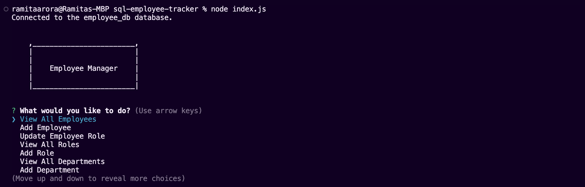

# SQL Employee Tracker

## UCLA Bootcamp Module 12 Challenge

## Description

In this project, the user will be able to track, manage and update employee records. The following was implemented:

1. Upon opening the application, the user is presented with a menu to view all departments, view all roles, view all employees, add a department, add a role, add an employee, and update an employee role.
2. On selecting "view all departments", the user is shown a table with all the department information.
3. On selecting "view all roles", the user is shown a table with all the roles information.
4. On selecting "view all employees", the user is shown a table with all the employee information.
5. On selecting "add a department", the user will be prompted for a department name to add a new department.
6. On selecting "add a role", the user will be prompted for the role name, salary and to select the department.
7. On selecting "add an employee", the user will be prompted for the first name, last name, select a role and select a manager (if any).
8. On selecting "update an employee role", the user will be able to select an employee and select a new role for that employee.

## Installation

To install, run `npm install`.
To run, run `node index.js`.

## Usage

A video can be viewed at: https://drive.google.com/file/d/1Sok48gTfKwx7gOI-2xPF7EhT7JwzkQGe/view.

## Credits

This project was created by Ramita Indurkhya.
